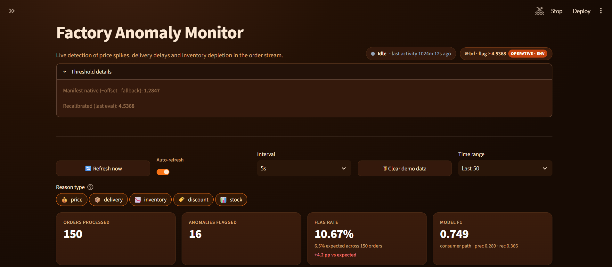
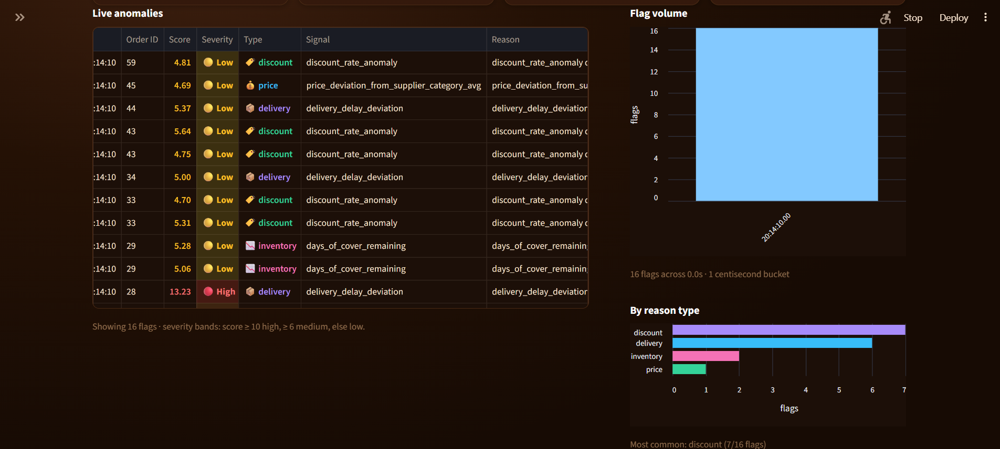
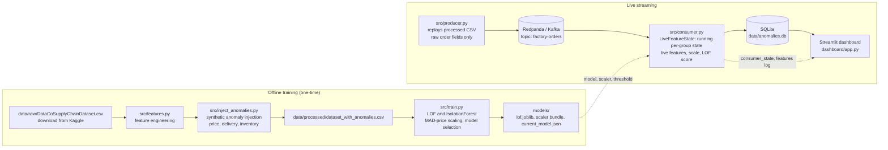

# Factory Anomaly Detection — Streaming Supply-Chain Monitoring


Factories lose money and production time because procurement, delivery, and
inventory problems are usually discovered **after the damage is done** — a
shipment that arrives two weeks late, an order priced far above its category
baseline, a stock that silently runs out — not before. This project is a
real-time anomaly-detection pipeline that flags those problems *as the orders
arrive*: a producer streams order records through **Redpanda/Kafka**, a
consumer computes **live per-group feature state** from the raw fields of each
order (price deviation, delivery delay, simulated stock level, days of cover),
scores every row with a trained **LOF outlier model**, and writes flagged
anomalies to **SQLite**, where a **Streamlit dashboard** surfaces them in
real time with severity, reason, and threshold provenance. The offline
training path (feature engineering → synthetic anomaly injection → model
training) is kept separate, so the deployed model can be rebuilt and audited
independently of the live stream.

### Dashboard Preview

<p align="center">
  
</p>

<br>

<p align="center">
  
</p>

## Features

- Real-time anomaly detection using Redpanda/Kafka
- Live feature engineering during stream processing
- LOF-based outlier detection
- Interactive Streamlit dashboard
- SQLite anomaly storage
- Offline retraining pipeline
- End-to-end evaluation tools

## Architecture



**Live path** — `producer.py` streams only raw order fields (no labels, no
precomputed features) into the `factory-orders` topic. `consumer.py` maintains
a `LiveFeatureState` seeded from the pre-injection baseline, computes five
features live per order (`price_deviation_from_supplier_category_avg`,
`delivery_delay_deviation`, `discount_rate_anomaly`, `stock_after_order`,
`days_of_cover_remaining`), scales them exactly as training did (MAD-scaled
price + standard-scaled rest), scores them with the deployed LOF novelty
model, and flags rows whose anomaly score crosses the operative threshold.
Flagged rows land in SQLite; the dashboard also reads the per-order feature
log and the consumer's self-reported threshold state.

**Offline path** — features are engineered from the raw Kaggle dataset,
three non-overlapping anomaly families (price spikes, delivery delays,
inventory-depletion demand bursts) are injected, and LOF / IsolationForest
models are trained and compared; the best model, its scaler bundle, and a
manifest naming the winner are written to `models/`.

## Setup

1. **Create and activate a virtual environment**

   ```bash
   python -m venv .venv
   # Windows:  .venv\Scripts\activate
   # macOS/Linux: source .venv/bin/activate
   ```

2. **Install dependencies**

   ```bash
   pip install -r requirements.txt
   ```

3. **Download the dataset** — download `DataCoSupplyChainDataset.csv` from
   [Kaggle](https://www.kaggle.com/datasets/shashwatwork/dataco-smart-supply-chain-for-big-data-analysis)
   and place it at `data/raw/DataCoSupplyChainDataset.csv`. The raw CSV is
   git-ignored (≈96 MB) — download it, don't commit it.

4. **Regenerate the injected dataset** (the processed CSV is also git-ignored;
   it is deterministic and regenerates in seconds)

   ```bash
   python -m src.inject_anomalies   # writes data/processed/dataset_with_anomalies.csv
   ```

   Optional: retrain the model from scratch (`python -m src.train`). The
   committed artifacts in `models/` already work, so this is only needed if
   you change the pipeline.

5. **Start Redpanda (Kafka-compatible)**

   ```bash
   docker compose up -d
   docker compose ps   # wait for the redpanda healthcheck to pass
   ```

6. **Run the pipeline** — three terminals, in this order:

   ```bash
   python -m src.producer    # terminal 1 — streams orders into the topic
   python -m src.consumer    # terminal 2 — scores live, flags anomalies
   streamlit run dashboard/app.py   # terminal 3 — live dashboard
   ```

## Tech Stack

- 🐍 Python
- 📊 Streamlit
- 📨 Redpanda / Apache Kafka
- 🗄 SQLite
- 🤖 scikit-learn
- 🐼 pandas
- 🐳 Docker
- 💾 Joblib

## Model metrics (consumer / live path)

Evaluated end-to-end on the full replayed stream through the same code path
the live consumer uses (`evaluate_stream.py`), with the consumer-path
recalibrated threshold (≈4.54):

| Metric | Value |
| --- | --- |
| Precision | **0.289** |
| Recall | **0.366** |
| F1 | **0.323** |

Recall by anomaly family:

| Family | Recall | Why |
| --- | --- | --- |
| `delivery_delay` | **~99.9%** | near-perfect — see below |
| `price_spike` | **~25.7%** | genuinely hard |
| `inventory_depletion` | **~15.6%** | genuinely hard |

**Why delivery is easy and price/inventory are hard.** This is real signal
separation, not a bug. Delivery delays are injected as **+10–15 extra days**
against scheduled shipping — a huge, cleanly separated outlier in per-category
delay space, so nearly every injected delay clears the threshold (99.9%
recall) at almost no false-positive cost. Price spikes, by contrast, are only
a **1.25–1.5×** multiplier over a rolling-median baseline, and the natural
price variation across categories, regions, and order quantities overlaps that
band heavily — no threshold can pull out the spikes without also flagging a
large share of normal orders (25.7% recall). Inventory depletion is scored on
a **simulated** stock proxy whose normal low-stock states overlap the injected
demand bursts, so the feature only partially separates them (15.6% recall).
The overall numbers are the honest cost of flagging hard, overlapping signals
at a sane false-positive rate.

## Engineering Notes — bugs found and fixed

**1. The unstable-sort alignment bug (feature-to-row scrambling).**
*Before:* the feature builder sorted the order history with pandas' default
(unstable) quicksort and reset the index. With tens of thousands of duplicate
timestamps, the unstable tie order differed from the stable order every other
pipeline stage used — so rolling price baselines were silently attached to the
**wrong rows**, scrambling price deviations across the dataset. The corrupted
column ended up ~60% exact zeros, which directly produced the degenerate MAD
that later triggered the scale bug below. *After:* the sort is a stable
`mergesort` that preserves the original index, so per-group rolling results
are assigned back to their own rows. The frozen-baseline reconstruction in the
injection step is now documented as load-bearing on that alignment.

**2. The MAD-epsilon scaling bug (~1e6× inflated anomaly scores).**
*Before:* when a zero-inflated price-deviation column produced a **zero MAD**,
the scale fell back to a near-zero epsilon (1e-6). At serving time every real
dollar of deviation became a scaled value of ~1,000,000, swamping the other
four features, exploding the anomaly scores by ~1e6×, and generating absurd
"reason" strings. A second variant of the bug silently used the *epsilon'd
MAD* instead of the *final scale*, shifting the serving scale by 1.4826× and
moving the whole score distribution. *After:* `resolve_price_scale()` uses a
data-driven fallback chain — MAD over the nonzero deviations, then the
standard deviation, then 1.0 — and **never** a near-zero epsilon; the scaler
bundle now stores the exact final `price_scale` and both the consumer and the
evaluation tooling serve on it directly.

**3. The mixed US/ISO date-format bug (silently dropped rows).**
*Before:* injected burst rows were written with ISO dates while the raw data
uses US-format strings; a plain `to_datetime` coerced the minority format to
`NaT` and **silently dropped those rows** on any re-read. *After:* the
producer parses with `format="mixed"`, and the injection script writes burst
dates in the same US-format family as the source data.

## Known limitations

- **Training/serving feature-parity gap** — the model is trained on features
  computed offline over the full history, while serving computes them live
  from running per-group state. The two are close but not bit-identical (the
  evaluation tooling measures and recalibrates for this gap), which is why the
  consumer path uses its own recalibrated threshold rather than the native
  model offset.
- **No real supplier identity in DataCo** — the dataset's supplier field is
  not a genuine supplier identifier, so supplier-like grouping is proxied via
  **Order Region**.
- **Inventory stock levels are simulated, not real** — `stock_after_order` and
  `days_of_cover_remaining` come from a synthetic demand-window simulation,
  not actual inventory data.

## Threshold / configuration

Flagging threshold is controlled by the `ANOMALY_THRESHOLD` env var on the
consumer (optional). Resolution order:

1. **`ANOMALY_THRESHOLD`** (env) — a row is flagged iff
   `anomaly_score >= threshold` (source: `env`).
2. **Manifest threshold** — the model's native `-offset_`, stored in
   `models/current_model.json` (source: `manifest`), used when the env var is
   unset.
3. **Model `predict()` labels** — last resort when neither exists.

The consumer writes the **operative** value and its source to
`data/consumer_state.json`, and the dashboard's model badge shows exactly what
is being flagged with — e.g. `flag ≥ 4.5368 · env` — plus the manifest native
fallback and the last recalibrated evaluation threshold.

## Project layout

```
src/producer.py          streams raw order fields → Redpanda/Kafka
src/consumer.py          live features → scale → LOF score → SQLite flags
src/features.py          offline feature engineering (stable-sort aware)
src/inject_anomalies.py  synthetic anomaly injection + inventory simulation
src/train.py             model training, selection, scaler bundle, manifest
src/live_state.py        running per-group feature state (serving)
src/offline_reference.py batch reference features for verification/eval
src/evaluate_realistic.py / src/evaluate_stream.py  end-to-end evaluation
src/model_registry.py    shared model-file/threshold resolution
dashboard/app.py         Streamlit dashboard
data/                    raw (ignored) · processed (ignored) · runtime outputs (ignored)
models/                  trained artifacts (committed)
```

## License

MIT — see [LICENSE](LICENSE).
